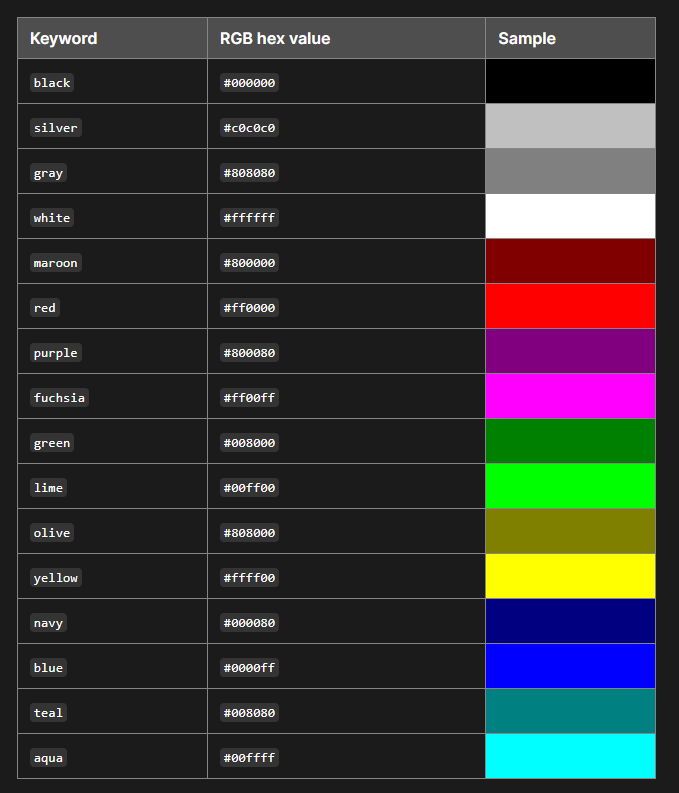

# CSS Core Concepts

## CSS specifications and the W3C

[w3c cascading style sheets home page](https://www.w3.org/Style/CSS/)


## CSS syntax and terminology

HTML and CSS standards

[Code Guide](https://codeguide.co/)

### CSS Rule

#### Declaration block

Selector
Declaration
Property
Value

```css
body {
    background: paleturquoise;
}
```

### Short and Longhand Properties

```css
/* Shorthand properties are defined with multiple values. */
    padding: 10px 5px 20px 15px;

/* Longhand properties are defined with individual values. */
    padding-top: 10px;
    padding-right: 5px;
    padding-bottom: 20px;
    padding-left: 15px;
```

### Comments

```css
/* CSS comment */
```

### Whitespace

Requires syntax for certain uses

```css
padding: 10px 5px;
```

## CSS values and units

|Property|Value|
|--------|-----|
|color|red|
|color|#3c8453|
|color|rgb(205,133,63)|
|font-size|10px|
|font-size|1.2rem|
|font-size|125%|
|Property|Value|

|Property|Value/Data Type|HTML|
|--------|---------------|----|
|color|<color\>|<p\></p\>|

### Numeric Data Types

* Number-based values
* Used with or wihout units to define diffent styles

```css
width: 80%;
height: 1vh;
border-width: 2px;
animation-iteration-coutn: 2;
```

* <integer\>
    A whole number that can be negative or positive
* <number\>
    A whole number or a fraction with decimals
* <percentage\>
    A fraction of another value (usually a parent or ancestor element)
    that uses a <number\> with a percentage unit
* A <dimension\> is a number value with a unit
  * Represents data types such as
    <time\>, <resolution\>, <length\> and more

```text
<time> 12s, 5.5ms
<resolution> 96dpi, 3dppx
<length> 100px, 20vw
```

#### <length\>

* Used to define a distance value
    (such as **width** or **font-size**)
* <number\> values are used with an
    *absolute* or *relative* unit

##### Absolute <length\> Units

* Fixed units based on physical measurements
* Pixels (px) are used for web

```text
px: pixels
cm: centimeters
mm: millimeters
Q: quarter-millimeters
in: inches
pt: points
```

##### Relative <length\> Units

* Define a length based on another length
* **em** is relative to the font size of an ancestor element
* **rem** is relative to the root (html) element
* Viewport-based units are relative to the size of the browser viewport
* **vw** is relative to the viewport width
* **vh** is relative to the viewport height
* **vmin** is the smaller of the **vw** or **vh**
* **vmax** is the larger of the **vw** or **vh**

```text
1vw = 1% of the viewport width
1vh = 1% of the viewport height
1vmin = 1% of the smallaer of vw and vh
1vmax = 1% of the larger of vw and vh
```

### Keywords

* Textual data type
* Predefined values that vary depending on the property
* All valid keywords are [documented](https://developer.mozilla.org/en-US/docs/Web/CSS/Reference) in the CSS specifications

```css
background: blue;
font-size: medium;
border-style: dashed;
```

### Functions

* Function values can include more complex values
* Start with the name of the function, followed by parentheses
* One or more arguments are used to compute a value

```css
transform: rotate(90deg); /* Rotates an element */
width: calc(80% - 20px); /* Calculates a value */
background-image: url(my-image.jpg); /* Sets a background image */
```

[mdn CSS values and units](https://developer.mozilla.org/en-US/docs/Learn/CSS/Building_blocks/Values_and_units)

## The color property and values

### color

The **color** property changes an element's text color
    and  text decorations (such as underline or strikethrough).
It is defined with different ypes of <color\> values.

#### Keyword values

```css
/* Predefined keywords */
color: red;
color: blue;
color: green;
color: black;
color: mediumseagreen;
color: oldlace;
color: blanchedalmond;
color: conflowerblue;
color: darkslategray;
```

#### [Named color](https://developer.mozilla.org/en-US/docs/Web/CSS/named-color)



[color guide](https://colours.neilorangepeel.com/)

### RGB funciton values

```css
/* Syntax */
rgb([red] [green] [blue])
color: rgb(0 0 0); /* Black */
color: rgb(255  255 255); /* White */
color: rgb(255 0 0); /* A shade of red */
color: rgb(0 255 0); /* A shade of green */
color: rgb(0 0 255); /* A shade of blue */

color: rgb(0 0 0 / 0.5); /* Black with 50% opacity */
color: rgb(0 0 255 / 25%); /* Blue wiht 25% opacity */

/* Legacy syntax with comma-separated values */
color: rgb(255, 255, 255);
color: rgba(255, 255, 255, .5);
```

### RGB hexadecimal values

```css
/* Syntax */
#rrggbb or #RRGGBB

color: #000000; /* Black */
color: #ffffff; /* White */
color: #ff0000; /* A shade of red */
color: #008000; /* A shade of green */
color: #0000ff; /* A shade of blue */

/* Shorthand */
color: #000;
color: #f00;

/* With alpha channel */
#rrggbba or#rrggbbaa

color: #9ACD320; /* Yellowgreen with no opacity (full transparency) */
color: #9ACD32FF; /* Yellowgreen with full opacity (no transparency) */
```

* Use a base-16 hexadecimal nuber system
* Sixteen symbols are used to denote the values from 0 to 15 (0-9,A-F)

|0|1|2|3|4|5|6|7|8|9|A|B|C|D|E|F|
|-|-|-|-|-|-|-|-|-|-|-|-|-|-|-|-|
|0|1|2|3|4|5|6|7|8|9|10|11|12|13|14|15|

* The alpha channel uses the base-16 system

```css
color: #9ACD321A; /* Yellowgreen with 10% transparency */
color: rgb(154 205 50 / 10%); /* Yellowgreen with 10% transparency */
color: rgb(154 205 50 / 0.1); /* Yellowgreen with 10% transparency */
```

[hex opacity table](https://davidwalsh.name/hex-opacity)

[how to understand hexadecimal](https://www.wikihow.com/Understand-Hexadecimal)

[all color value options](https://developer.mozilla.org/en-US/docs/Web/CSS/color_value)

## Creating a color palette

[canva](https://www.canva.com/colors/)

[coolors.co](https://coolors.co/)

## Type and universal selectores

### CSS selectors

* Used to **select** specific HTML elements and apply styles
* Different **types** of selectors are used to determine
    **which** element the style should be appliled to

#### Type selector

* Also referred to as *element selector*
* Matches to the element name but without the angled brackets

```css
/* This style will apply ato all <h2> elements. */
h2 {
    color: darkslategray;
}
```

#### Universal Selector

* Selects **all** elements on the HTML page using an asterisk (*)
* May cause performance issues and should be used sparingly

```css
* {
    /* This style will apply to ALL the elements */
    border: 1px solid black;
}
```

## ID selectors

* Match a single unique element
* Add an ID attribute to the HTML element

```html
<header id-"custom-name"></header>
```

* The attribute value is the selector, starting with number symbol (#)

```css
#custom-name {
    background: lightblue;
}
```

* Don't use spaces
* Separate words with a dash, an underscore, or camel casing

```text
id="idname"
id="id_name"
id="idn-ame"
id="idName"
```

## Class selectors

## Descendant combinators and selector lists

## The background property

## Pseudo-classes and pseudo-elements

## Inheritance and the cascade

## Specificity
